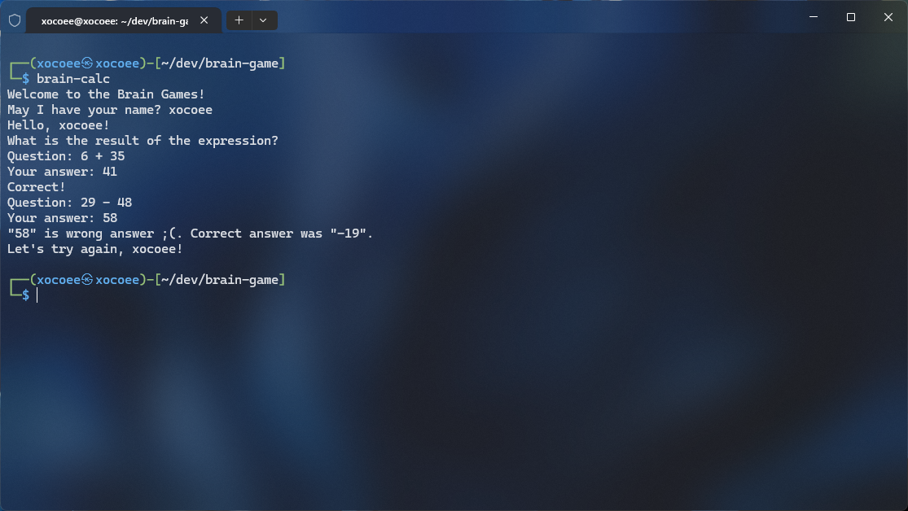
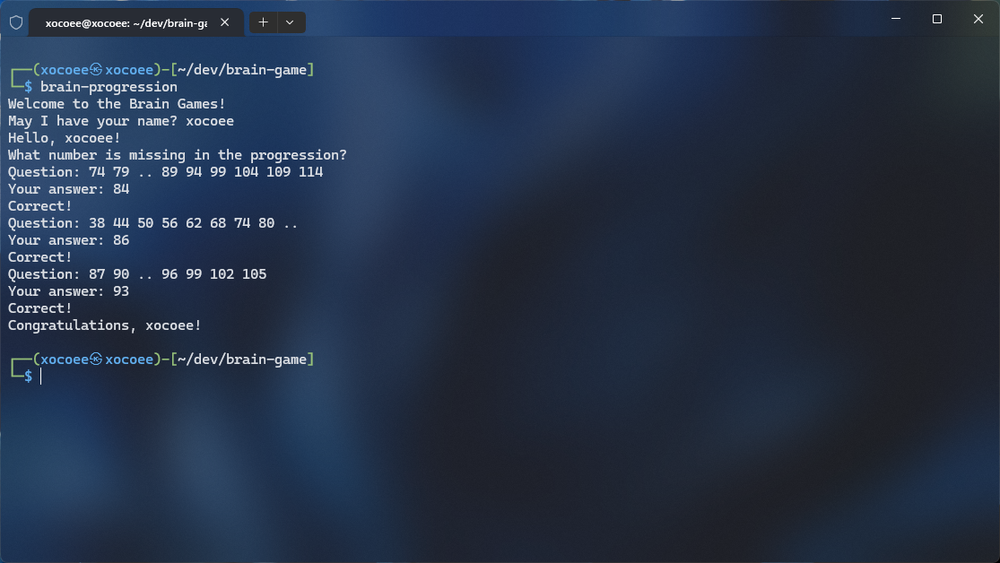
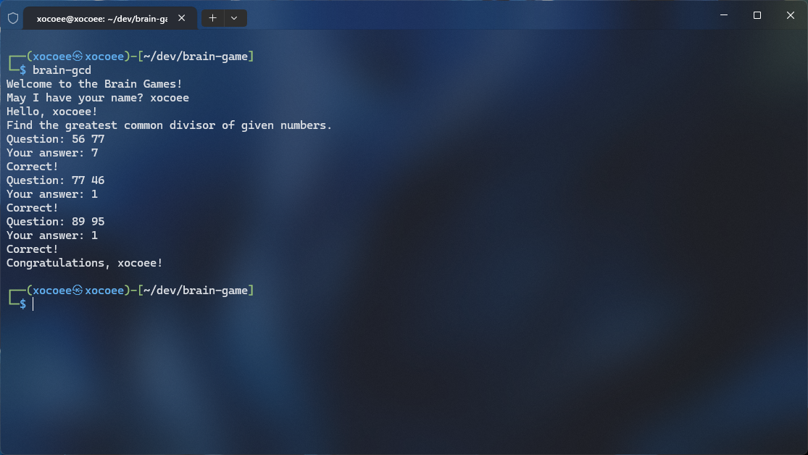
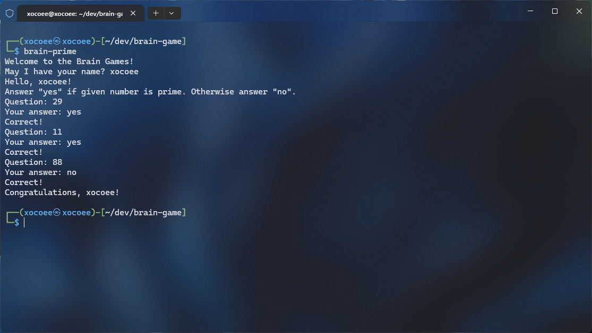

# Project "Brain Games"

<a href="https://codeclimate.com/github/xocoee/frontend-project-44/maintainability"></a>

## Project Description:

"Brain Games" is a project consisting of 5 console games designed to train your brain. Each game asks 3 questions that you need to answer correctly. If you answer all the questions, you are considered to have completed the game. In case of an incorrect answer, the game will end and you will be offered to try again.

## Installation:
```sh
npm install
```
```sh
npm link
```

##  To launch games, enter the following commands into the console:
launch the game "Calculator"
```sh
brain-calc
```
launch the game "Progression"
```sh
brain-progression
```
launch the game "Number is even"
```sh
brain-even
```
launch the game "Greatest Common Divisor"
```sh
brain-gcd
```
launch the game "Prime number"
```sh
brain-prime
```

## Demonstration work of the game:

### Calculator
The user is shown a random mathematical expression, which they need to evaluate and provide the correct answer.

### Progression
The user is shown a series of numbers forming an arithmetic progression, with one of the numbers replaced by two dots. The player must determine the missing number.

### Even number
The user is shown a random number. They need to answer "yes" if the number is even, or "no" if it is odd.

### GCD
The user is shown two random numbers. The user must calculate and enter the greatest common divisor of these numbers.

### Prime number
The user is shown a random number. They need to answer "yes" if the number is prime, or "no" if it is not prime.
